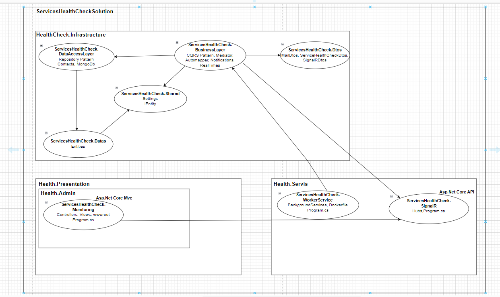

<h1>Windows Services Health Check Project</h1>

<h3>1. Entrance</h3>

Windows services health check project is a windows service health check project that checks the status of windows services installed in our system by taking the names of these services from the appsettings.json file. If at least one of the services whose status is checked is not working, a notification is sent to the admin e-mail address written in the appsettings.json file. Logs the status of the services to the mongodb database. It controls the resource consumption of the services (e.g. CPU, memory usage) and instantly monitors all this data on a frontend.

<h3>2. Used Technologies</h3>

.Net Worker Background Services, WindowsServices, Asp.Net Core Mvc, Asp.Net Core API, Repository Design Pattern, CQRS Design Pattern, Mediator, Dtos, AutoMapper, SignalR, MailKit, MongoDb

<h3>3. General Outlines of the Architecture Used in the Project</h3>

<h3>4. Language and Development Environment Used: C# - .Net 8.0</h3>

<h3>5. Video Impression</h3>

For the video demonstration of the project, change the place that says "github.com" in your URL to "github.dev". Then you can follow this path and access the video.
HealthCheck.Presentation -> HealthCheck.Admin -> ServicesHealthCheck.Monitoring -> wwwroot -> videos -> projectvideoimpression.mp4

 

 <b>Note: </b> After installing the project, go to the appsettings.json file. Edit the "ConnectionStrings", "Services", "Notifications" fields according to your own system.

 <b>Note: </b> In order for the notification service to work properly in the application, please update the e-mail addresses under the "Notifications" heading in the appsettings.json file accordingly. Then, turn on the two-step authentication feature of the sender's e-mail address in the application. Finally, go to the security section of the e-mail address and create a password for the application from the "application passwords" section. Go to the mailservice class in the business layer and type your password in the 2nd parameter shown in the 

  
<footer><b>Supported by CTS Yazılım as an intern project</b></footer>