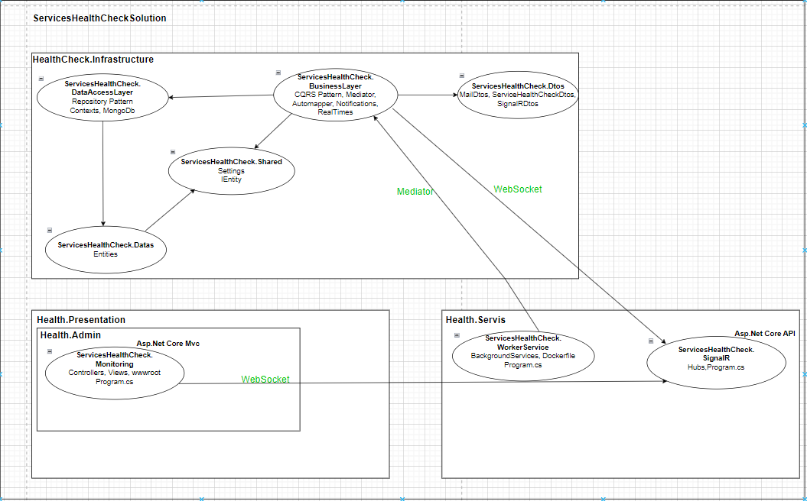
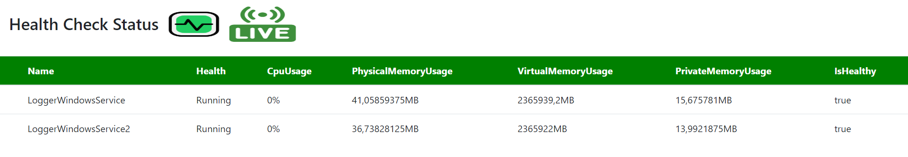
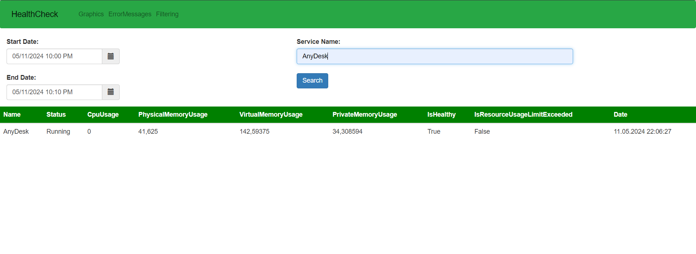
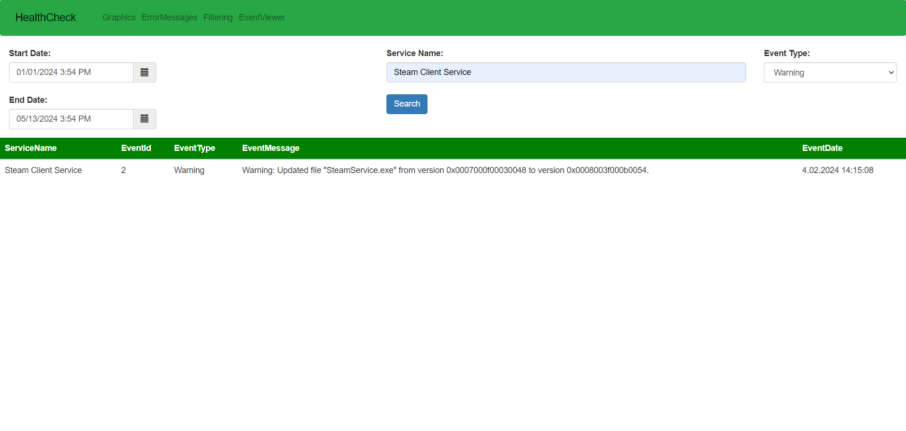
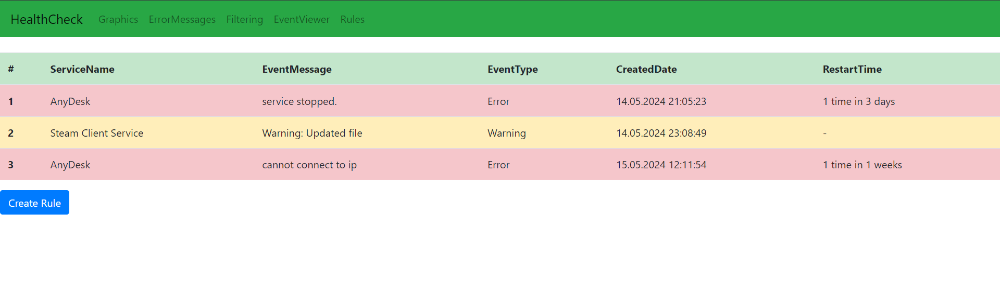
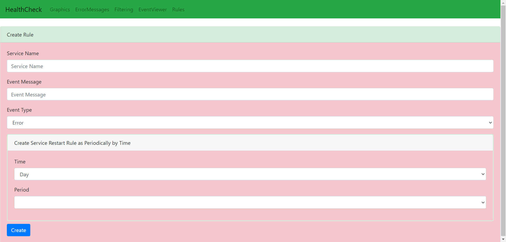
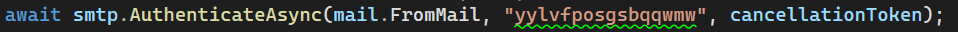
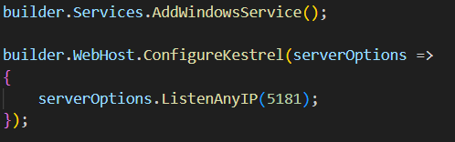
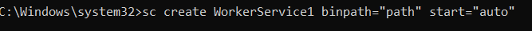
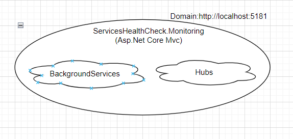

<h1>Windows Services Health Check Project</h1>

<h3>1. Entrance</h3>

Windows services health check project is a windows service health check project that checks the status of windows services installed in our system by taking the names of these services from the appsettings.json file. If at least one of the services whose status is checked is not working, a notification is sent to the admin e-mail address written in the appsettings.json file. Logs the status of the services to the mongodb database. It controls the resource consumption of the services (e.g. CPU, memory usage) and instantly monitors all this data on a frontend. It logs service statuses temporally according to the temporal value entered by the user from the appsettings.json file. You can filter these logged values ​​in a separate interface (by service name, time interval, etc.). It connects to Eventviewer and writes the error and warning logs of the relevant services to the database. It can filter the logs from a separate interface. From a separate interface, a rule can be created for the relevant service based on the event message, event type and service name entered by the user. According to this created rule, if the relevant service gives an error or warning, it is restarted. In addition, the user can restart the relevant service at periodic intervals entered (once a week, every 2 days, etc.).

The project being developed is discussed in 3 parts. These are as follows:  
<b>HealthCheck.Infrastructure:</b> This is the part where various business and database processes of our application are carried out and the infrastructure of our application is hosted.  
<b>HealthCheck.Presentation:</b> This is the part where data from the worker service communicates with SignalR and is instantly displayed on the frontend.  
<b>HealthCheck.Servis:</b> Background services (worker services) required for our application are the part that includes some 3rd party services.

<h3>2. Used Technologies</h3>

.Net Worker Background Services, WindowsServices, Asp.Net Core Mvc, Asp.Net Core API, Repository Design Pattern, CQRS Design Pattern, Mediator, Dtos, AutoMapper, SignalR, MailKit, Serilog, MongoDb

<h3>3. General Outlines of the Architecture Used in the Project</h3>

<h3>4. Technical Information</h3>
<h4>HealthCheck.Infrastructure - Layers</h4>

    <b>ServicesHealthCheck.Datas: </b> 
It is the layer where classes corresponding to collections in the database are defined.

    <b>ServicesHealthCheck.DataAccessLayer: </b> It is the layer where database-related CRUD operations are performed. There is a context class that corresponds to the database and where configuration settings related to the database are made. It references the entities layer to correspond to collections in the database. Since there are not many relational scripts and for fast read and write operation
Mongodb was used as the database.

    <b>ServicesHealthCheck.Shared: </b> It is the layer where classes and interfaces commonly used by more than one layer are defined. It contains IEntity and Settings elements. IEntity defines classes as collections of databases. The Settings class is the class that corresponds to the database configuration settings.

    <b>ServicesHealthCheck.Dtos: </b> It is the layer where dto classes are hosted instead of direct entities in the execution of database-related CRUD operations. Dto classes are used to send and receive data with the outside world. It increases the security of our application. Sending and receiving data to the outside world through entities creates security vulnerabilities and causes unwanted information flow. For this reason, dto classes are used to interact with the outside world.

    <b>ServicesHealthCheck.BusinessLayer: </b> It is the layer where application-related business processes are carried out and database manager classes are located. CQRS design pattern is used to separate data reading and writing operations in CRUD operations. In this way, flexibility and sustainability are increased. The mediator library is used to use the CQRS design pattern effectively. The automapper library is used to easily perform mapping between dto classes and entity classes. Mailkit library is used to send notifications. The signalr.client library was used within the service under the Realtimes folder to send instant data from the Worker Service to the signalR layer.

<h4>HealthCheck.Servis - Layers</h4>

<b>ServicesHealthCheck.WorkerService: </b> It is the layer that contains background services that instantly check the status and resource consumption of Windows services installed in our system and communicate with the business layer and log this information into the database. At the same time, it communicates with the business layer and sends the status and resource consumption data of instant incoming Windows services to the SignalR layer.

<b>ServicesHealthCheck.SignalR: </b> 
It is the layer that allows data coming from the Worker service to be received via SignalR technology instead of receiving it directly. It is based on websocket technology. It allows constantly changing data to be displayed instantly on the front end. The reason for collecting data via SignalR is to make the application more manageable (for example, filtering on a client basis) and to reduce the code complexity that may occur. It contains the hub structure that forms the center of SignalR. Data sending and receiving operations are carried out through the hub structure. This layer is implemented with Asp.Net Core API.

<h4>HealthCheck.Presentation -> HealthCheck.Admin - Layers</h4>

<b>ServicesHealthCheck.Monitoring: </b> 
    It is the layer that communicates with the SignalR layer and displays the incoming instant data on the front. It was built with Asp.Net Core Mvc.

<h3>5. Language and Development Environment Used: C# - .Net 8.0</h3>

<h3>6. ScreenShots</h3>

Service Health Check

Service Health Check By Filter

Service Event Viewer Log By Filter

List Rule

Create Rule

<h3>7. Video Impression</h3>

For the video demonstration of the project, change the place that says "github.com" in your URL to "github.dev". Then you can follow this path and access the video. 
HealthCheck.Presentation -> HealthCheck.Admin -> ServicesHealthCheck.Monitoring -> wwwroot -> videos -> projectvideoimpression.mp4

<h3>8. Setup</h3>
<ul>
    <li>
 After installing the project, go to the appsettings.json file. Edit the "ConnectionStrings", "Services", "Notifications" fields according to your own system.

    </li>
    <li>
 In order for the notification service to work properly in the application, please update the e-mail addresses under the "Notifications" heading in the appsettings.json file accordingly. Then, turn on the two-step authentication feature of the sender's e-mail address in the application. Later, go to the security section of the e-mail address and create a password for the application from the "application passwords" section. Go to the mailservice class in the business layer and type your password in the 2nd parameter shown in the 

    </li>
    
    <li> 
Finally, click on the down arrow icon next to the start button. Click on the section that says "Configure startup projects". Select the "Multiple startup projects" option. Bring the "ServicesHealthCheck.WorkerService", "ServicesHealthCheck.SignalR", "ServicesHealthCheck.Monitoring" projects to their start status, respectively. Then press the "apply" and "ok" buttons at the bottom right. Then start the project from the start button.
    </li>
</ul>
<h3>9. Setup of the project by plug-and run method.
</h3>

The project was discussed as a Windows service in the future. Accordingly, background services from the worker service were added to the monitoring section, which was implemented with Asp.Net Core MVC, and the necessary hubs were added from the SignalR section, which was implemented with Asp.Net Core API. Then, the necessary configuration settings were made in the program.cs file. The following code blocks were added to program.cs to set the project as a windows service.

Publish the monitoring project. You can use the following command to run the project as a windows service.

A setup project was created to install the project with its database components. First of all, create Items->MongoDb folders in the solution where the project is located. Then download the mongodb file from the link below and put it into the mongodb folder you created.

https://www.mongodb.com/try/download/community

Then, go to the setup project in the solution and go to bin->debug->net8.0. Run Setup.exe as an administrator. After the application is successfully installed, go to localhost:5181 from the browser.

<b>Note:</b> To see that the application runs as a Windows service, type "services" in the Windows search section. Find the HealthCheckProject service name in the window that opens and you can see that it is running successfully.
<h4>Working logic of the project as a windows service</h4>

  
<footer><b>Supported by CTS Yazılım as an intern project.</b></footer>
