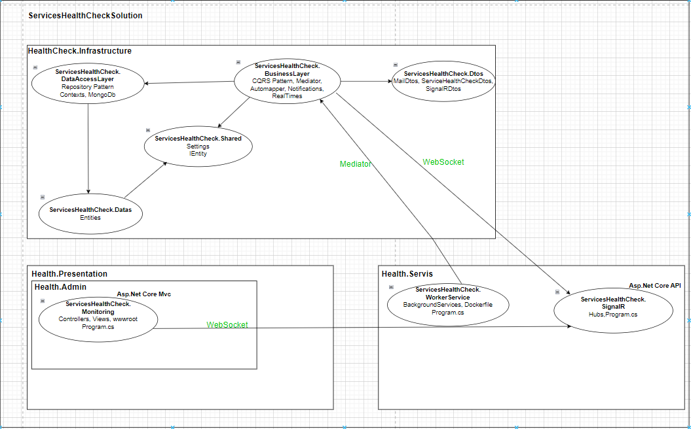
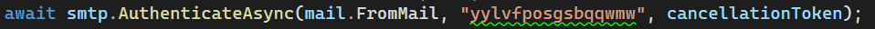
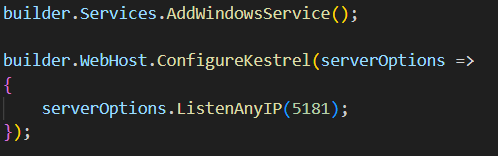
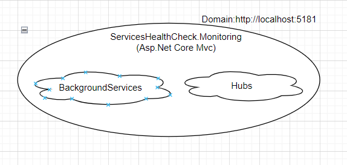

<h1>Windows Servisler Durum Kontrolü Projesi</h1>

<h3>1. Giriş</h3>

Windows servis sağlık kontrolü projesi, sistemimizde yüklü olan Windows hizmetlerinin durumunu, bu hizmetlerin adlarını appsettings.json dosyasından alarak kontrol eden bir Windows servis sağlık kontrolü projesidir. Durumu kontrol edilen servislerden en az biri çalışmıyorsa appsettings.json dosyasında yazılı olan admin e-posta adresine bildirim gönderilir. Hizmetlerin durumunu mongodb veritabanına kaydeder. Hizmetlerin kaynak tüketimini (örneğin CPU, bellek kullanımı) kontrol eder ve tüm bu verileri ön uçta anlık olarak izler. Kullanıcının appsettings.json dosyasından girdiği zamansal değere göre servis durumlarını veritabanına kaydeder. Kaydedilen bu değerleri ayrı bir arayüzde (servis adına, zaman aralığına vb. göre) filtreleyebilirsiniz. Eventviewer'a bağlanarak ilgili servislerin hata ve uyarı loglarını veritabanına yazar. Logları ayrı bir arayüzden filtreleyebilir. Ayrı bir arayüzden kullanıcının girdiği olay mesajı, olay türü ve hizmet adına göre ilgili hizmet için kural oluşturulabilir. Oluşturulan bu kurala göre ilgili servis hata veya uyarı verirse yeniden başlatılır. Ayrıca kullanıcı girilen periyodik aralıklarla (haftada bir, 2 günde bir vb.) ilgili hizmeti yeniden başlatabilir.

Geliştirilmekte olan proje 3 bölümde ele alınmaktadır. Bunlar aşağıdaki gibidir:  
<b>HealthCheck.Infrastructure:</b> Uygulamamızın çeşitli iş ve veri tabanı süreçlerinin yürütüldüğü ve uygulamamızın altyapısının barındırıldığı bölümdür.  
<b>HealthCheck.Presentation:</b> Worker servisden gelen verilerin SignalR ile iletişim kurduğu ve anında ön uçta görüntülendiği kısımdır.  
<b>HealthCheck.Servis:</b> Uygulamamız için gerekli olan arka plan servisleri (worker services), bazı 3. parti servislerin yer aldığı kısımdır.

<h3>2. Kullanılan Teknolojiler</h3>

.Net Worker Background Services, WindowsServices, Asp.Net Core Mvc, Asp.Net Core API, Repository Design Pattern, CQRS Design Pattern, Mediator, Dtos, AutoMapper, SignalR, MailKit, Serilog, MongoDb, JQuery, Ajax

<h3>3. Projede Kullanılan Mimarinin Genel Hatları</h3>

<h3>4. Teknik Bilgilendirme</h3>
<h4>HealthCheck.Infrastructure - Katmanlar</h4>

    <b>ServicesHealthCheck.Datas: </b> 
Veritabanındaki koleksiyonlara karşılık gelen sınıfların tanımlandığı katmandır.

    <b>ServicesHealthCheck.DataAccessLayer: </b> Veritabanı ile ilgili CRUD işlemlerinin yapıldığı katmandır. Veritabanına karşılık gelen ve veritabanına ilişkin konfigürasyon ayarlarının yapıldığı bir context sınıfı bulunmaktadır. Veritabanındaki koleksiyonlara karşılık gelecek sınıflar için Datas katmanını referans alır. Çok fazla ilişkisel durumlar olmadığından ve hızlı okuma ve yazma işlemi için
Veritabanı olarak Mongodb kullanıldı.

    <b>ServicesHealthCheck.Shared: </b> Birden fazla katmanın ortak olarak kullandığı sınıfların ve arayüzlerin tanımlandığı katmandır. IEntity ve Settings öğelerini içerir. IEntity arayüzünü uygulayan sınıflar veritabanı koleksiyonları olarak tanımlanır. Settings sınıfı, veritabanı yapılandırma ayarlarına karşılık gelen sınıftır.

    <b>ServicesHealthCheck.Dtos: </b> Veritabanı ile ilgili CRUD işlemlerinin yürütülmesinde doğrudan entityler yerine dto sınıflarının barındırıldığı katmandır. Dto sınıfları dış dünyaya veri göndermek ve almak için kullanılır. Uygulamamızın güvenliğini arttırır. Entityler aracılığıyla dış dünyaya veri gönderilip alınması güvenlik açıkları oluşturmakta ve istenmeyen bilgi akışına neden olmaktadır. Bu nedenle dış dünyayla etkileşim kurmak için dto sınıflarından yararlanılmaktadır.

    <b>ServicesHealthCheck.BusinessLayer: </b> Uygulamaya ilişkin iş süreçlerinin yürütüldüğü, veritabanı manager sınıflarının bulunduğu katmandır. CRUD işlemlerinde veri okuma ve yazma işlemlerini ayırmak için CQRS tasarım deseni kullanıldı. Bu sayede esneklik ve sürdürülebilirlik artırıldı. Mediator kütüphanesi, CQRS tasarım modelini etkili bir şekilde kullanmak için kullanıldı. Automapper kütüphanesi, dto sınıfları ve entity sınıfları arasında maplemeyi kolayca gerçekleştirmek için kullanıldı. Mailkit kütüphanesi bildirim göndermek için kullanıldı. Signalr.client kütüphanesi, Worker Service'ten signalR katmanına anlık veri göndermek için Realtimes klasörü altındaki servis içinde kullanıldı.

<h4>HealthCheck.Servis - Katmanlar</h4>

<b>ServicesHealthCheck.WorkerService: </b> Sistemimizde yüklü olan Windows hizmetlerinin durumunu ve kaynak tüketimini anlık olarak kontrol eden ve iş katmanı ile iletişim kurarak bu bilgilerin veritabanına kaydedilmesini sağlayan arka plan servislerinin bulunduğu katmandır. Aynı zamanda iş katmanı ile haberleşerek anlık gelen Windows servislerin durum ve kaynak tüketim verilerini SignalR katmanına gönderir.

<b>ServicesHealthCheck.SignalR: </b> 
Worker servisinden gelen verilerin direkt olarak alınması yerine SignalR teknolojisi üzerinden alınmasına olanak sağlayan katmandır. Websocket teknolojisine dayanmaktadır. Sürekli değişen verilerin ön uçta anlık olarak görüntülenmesini sağlar. SignalR aracılığıyla veri toplanmasının nedeni, uygulamayı daha yönetilebilir hale getirmek (örneğin istemci bazında filtreleme yapmak) ve oluşabilecek kod karmaşıklığını azaltmaktır. SignalR'ın merkezini oluşturan hub yapısı yer alır. Veri gönderme ve alma işlemleri hub yapısı üzerinden gerçekleştirilir. Bu katman Asp.Net Core API ile ayağa kaldırılmıştır.

<h4>HealthCheck.Presentation -> HealthCheck.Admin - Katmanlar</h4>

<b>ServicesHealthCheck.Monitoring: </b> 
    SignalR katmanı ile haberleşen ve gelen anlık verileri ön tarafta görüntüleyen katmandır. Asp.Net Core Mvc ile oluşturulmuştur.

<h3>5. Kullanılan Dil ve Geliştirme Ortamı: C# - .Net 8.0</h3>

<h3>6. Ekran Görüntüleri</h3>

Servis Sağlık Durumu

Filtreleme İşlemine Göre Servis Sağlık Durumları

Servis Hata Logları

Filtreleme İşlemine Göre Servis Eventviewer Verileri

Kural Listeleme

Kural Oluşturma

<h3>7. Video Görüntüsü</h3>

Projenin video gösterimi için URL'nizde "github.com" yazan yeri "github.dev" olarak değiştiriniz. Daha sonra aşağıda belirtilen yolu takip ederek videoya ulaşabilirsiniz. 
HealthCheck.Presentation -> HealthCheck.Admin -> ServicesHealthCheck.Monitoring -> wwwroot -> videos -> projectvideoimpression.mp4

<h3>8. Kurulum</h3>
<ul>
    <li>
 Projeyi indirdikten sonra appsettings.json dosyasına gidiniz. "ConnectionStrings", "Services", "Notifications" alanlarını kendi sisteminize göre düzenleyiniz.

    </li>
    <li>
 Uygulamada bildirim hizmetinin düzgün çalışabilmesi için lütfen appsettings.json dosyasında "Notifications" başlığı altında yer alan e-posta adreslerini güncelleyiniz. Daha sonra uygulamada gönderenin e-posta adresinin iki adımlı kimlik doğrulama özelliğini açınız. Daha sonra e-posta adresinin güvenlik bölümüne gidin ve “uygulama şifreleri” kısmından uygulamaya ait şifreyi oluşturunuz. İş katmanında mailservice sınıfına gidin ve aşağıdaki şekilde gösterilen 2. parametreye şifrenizi yazınız. 

    </li>
    
    <li> 
Son olarak başlat butonunun yanındaki aşağı ok simgesine tıklayınız. "Başlangıç ​​projelerini yapılandır" yazan bölüme tıklayınız. "Birden çok başlangıç ​​projesi" seçeneğini seçiniz. Sırasıyla "ServicesHealthCheck.WorkerService", "ServicesHealthCheck.SignalR", "ServicesHealthCheck.Monitoring" projelerini başlangıç ​​durumuna getiriniz. Daha sonra sağ alttaki "Uygula" ve "Tamam" butonlarına basınız. Daha sonra başlat butonundan projeyi başlatınız.
    </li>
</ul>
<h3>9. Projenin Tak-Çalıştır Yöntemi ile Kurulumu
</h3>

Projenin ileride Windows hizmeti olarak ele alınması tartışıldı. Buna göre Asp.Net Core MVC ile uygulanan monitoring bölümüne, worker servisden background servisler, Asp.Net Core API ile uygulanan SignalR bölümünden ise gerekli hub'lar eklendi. Daha sonra program.cs dosyasında gerekli konfigürasyon ayarları yapıldı. Projeyi Windows hizmeti olarak ayarlamak için program.cs dosyasına aşağıdaki kod blokları eklendi.

Monitoring projesini publish ediniz. Projeyi Windows servisi olarak çalıştırmak için aşağıdaki komutu kullanabilirsiniz.

Projeyi veritabanı bileşenleriyle birlikte kurmak için bir setup projesi oluşturuldu. Öncelikle projenin bulunduğu solution'da Items->MongoDb klasörlerini oluşturunuz. Daha sonra mongodb dosyasını oluşturduğunuz mongodb klasörüne yerleştiriniz. 
ServicesHealthCheck.Monitoring projesini publish ediniz.

Ardından solution'daki setup projesine gidiniz ve bin->debug->net8.0'a gidiniz. Setup.exe'yi yönetici olarak çalıştırınız. Uygulama başarıyla yüklendikten sonra tarayıcıdan localhost:5181 adresine gidiniz.

<b>Not:</b> Uygulamanın Windows hizmeti olarak çalıştığını görmek için Windows arama kısmına "hizmetler" yazınız. Açılan pencerede HealthCheckProject hizmet adını bulunuz ve çalışma durumunu kontrol ediniz.
<h4>Projenin Windows servis olarak çalışma mantığı</h4>

  
<footer><b>CTS Yazılım tarafından stajyer projesi olarak desteklenmiştir.</b></footer>
